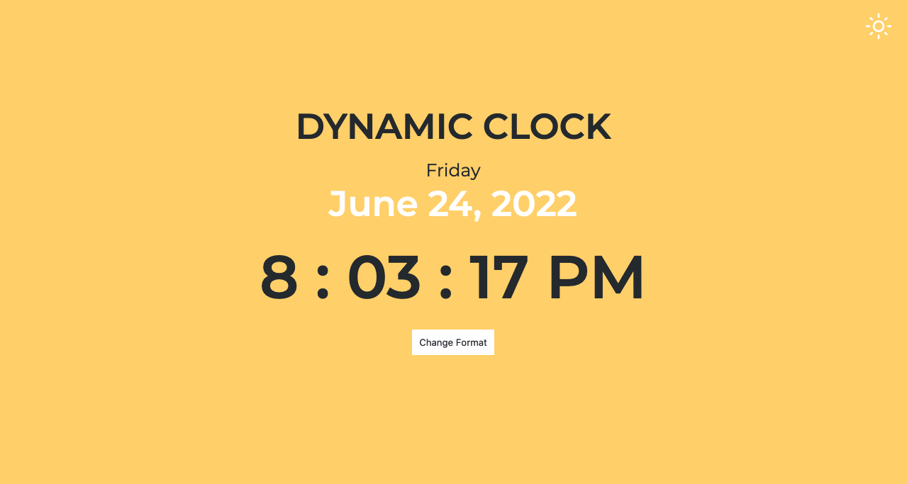

# Dynamic Clock
Dynamic Clock is a simple project that gets the current month,day, and time from their device. The user is able to switch from two time formats 12 hour and 24 hours.The usere can also switch from light and dark mode.

## Languages use:
The application use the following languages
..* HTML
..* CSS
..* JavaScript

